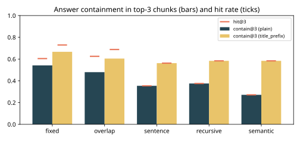
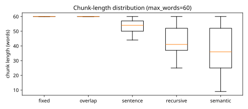
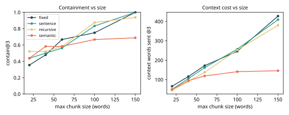

# Results -- ai-learn-18-rag-chunking-strategies

**Seed:** `42` | docs=8 manuals (~419 words each, 3355 total) | questions=48 (paraphrased) | max_words=60 | overlap=20 | retriever: BM25 (k1=1.5, b=0.75) over chunks

`hit@k`: a top-k chunk from the right manual overlaps the gold fact sentence. `contain@k`: a top-k chunk contains the **whole** answer string. `ctx@3`: words sent to the generator for k=3.

## plain chunks (real smoke run)

| strategy | hit@1 | hit@3 | contain@1 | contain@3 | contain@5 | MRR(contain)@10 | ctx@3 | chunks | indexed words | overhead |
|---|---:|---:|---:|---:|---:|---:|---:|---:|---:|---:|
| `fixed` | 0.188 | 0.604 | 0.146 | 0.542 | 0.646 | 0.353 | 171 | 59 | 3355 | 1.00x |
| `overlap` | 0.271 | 0.625 | 0.188 | 0.479 | 0.667 | 0.384 | 176 | 83 | 4855 | 1.45x |
| `sentence` | 0.104 | 0.354 | 0.104 | 0.354 | 0.479 | 0.280 | 155 | 65 | 3355 | 1.00x |
| `recursive` | 0.104 | 0.375 | 0.104 | 0.375 | 0.438 | 0.272 | 130 | 77 | 3355 | 1.00x |
| `semantic` | 0.083 | 0.271 | 0.083 | 0.271 | 0.312 | 0.215 | 115 | 89 | 3355 | 1.00x |

## title_prefix chunks (real smoke run)

| strategy | hit@1 | hit@3 | contain@1 | contain@3 | contain@5 | MRR(contain)@10 | ctx@3 | chunks | indexed words | overhead |
|---|---:|---:|---:|---:|---:|---:|---:|---:|---:|---:|
| `fixed` | 0.458 | 0.729 | 0.396 | 0.667 | 0.729 | 0.560 | 172 | 59 | 3518 | 1.05x |
| `overlap` | 0.479 | 0.688 | 0.396 | 0.604 | 0.750 | 0.554 | 183 | 83 | 5084 | 1.52x |
| `sentence` | 0.333 | 0.562 | 0.333 | 0.562 | 0.688 | 0.504 | 162 | 65 | 3534 | 1.05x |
| `recursive` | 0.354 | 0.583 | 0.354 | 0.583 | 0.729 | 0.526 | 138 | 77 | 3568 | 1.06x |
| `semantic` | 0.396 | 0.583 | 0.396 | 0.583 | 0.646 | 0.525 | 119 | 89 | 3602 | 1.07x |

## Chunk-length distribution (plain, words)

| strategy | mean | std | min | p50 | p90 | max |
|---|---:|---:|---:|---:|---:|---:|
| `fixed` | 56.9 | 10.5 | 4 | 60 | 60 | 60 |
| `overlap` | 58.5 | 5.7 | 24 | 60 | 60 | 60 |
| `sentence` | 51.6 | 8.4 | 20 | 54 | 59 | 60 |
| `recursive` | 43.6 | 9.6 | 25 | 41 | 58 | 60 |
| `semantic` | 37.7 | 13.9 | 9 | 36 | 57 | 60 |

## Size sweep (title-prefixed chunks): contain@3 / ctx@3

| strategy | 20 | 40 | 60 | 100 | 150 |
|---|---:|---:|---:|---:|---:|
| `fixed` | 0.354 / 66 | 0.479 / 116 | 0.667 / 172 | 0.750 / 246 | 1.000 / 428 |
| `sentence` | 0.438 / 50 | 0.500 / 105 | 0.562 / 162 | 0.833 / 257 | 1.000 / 409 |
| `recursive` | 0.521 / 45 | 0.521 / 90 | 0.583 / 138 | 0.875 / 252 | 0.938 / 380 |
| `semantic` | 0.438 / 49 | 0.583 / 95 | 0.583 / 119 | 0.667 / 141 | 0.688 / 146 |

## Plots

Wall time: 0.27s on CPU.
